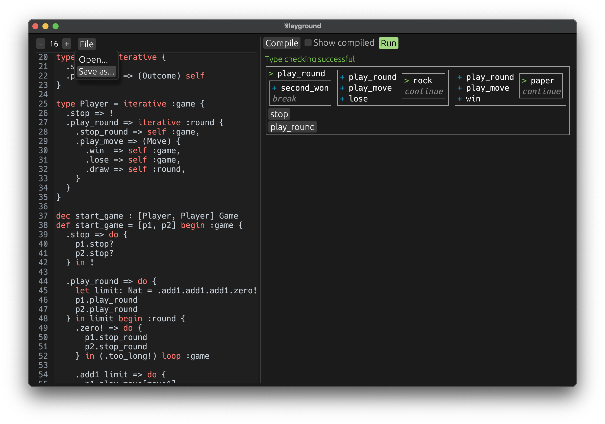

# **Par** is an _expressive, concurrent, total*_ language
## ...with linear types and duality

- 💬 **Join our [Discord](https://discord.gg/8KsypefW99),** or use the
  [Discussions](https://github.com/faiface/par-lang/discussions) as a forum to ask questions and share ideas!

- 🫶 If you'd like to support my effort to bring the power of linear logic into practical programming, you can do
  it via [GitHub Sponsors](https://github.com/sponsors/faiface).

- 🦀 If you like this **concurrent paradigm,** and want to use it **in a real programming language,** check out
  my Rust crate with the same name: **[Par](https://github.com/faiface/par).** It's a full implementation
  of **session types,** including non-deterministic handling of many clients.



## 🚀 Get started with the [Language Reference](https://faiface.github.io/par-lang/introduction.html)

It contains **a full guide** of the language and its type system.

**To run the playground:**

1. Install [Rust and Cargo](https://rustup.rs).
2. `git clone https://github.com/faiface/par-lang.git`
3. `cd par-lang`
4. `cargo run`

## 💡 [Examples](examples/)

Open an example in the interactive playground, and **play with any function.**

# ✨ Features

## 🧩 Expressive

**Duality** gives two sides to every concept, leading to rich composability. Whichever angle you take to
tackle a problem, there will likely be ways to express it.
**Par comes with these first-class, structural types:**

_(Dual types are on the same line.)_

- [**Pairs**](https://faiface.github.io/par-lang/types.html#pair-types) (easily extensible to tuples), and [**functions**](https://faiface.github.io/par-lang/types.html#function-types) (naturally curried).
- [**Eithers**](https://faiface.github.io/par-lang/types.html#either-types) (sum types), and [**choices**](https://faiface.github.io/par-lang/types.html#choice-types) (unusual, but powerful dispatchers).
- [**Recursive**](https://faiface.github.io/par-lang/types.html#recursive-types) (finite), and [**iterative**](https://faiface.github.io/par-lang/types.html#iterative-types) (co-recursive, potentially infinite) types, with totality checking.
- [**Universally,**](https://faiface.github.io/par-lang/types.html#universal-types) and [**existentially**](https://faiface.github.io/par-lang/types.html#existential-types) quantified generic functions and values.
- [**Unit,**](https://faiface.github.io/par-lang/types.html#the-unit-type) and [**continuation.**](https://faiface.github.io/par-lang/types.html#the-bottom-type)

These **orthogonal concepts** combine to give rise to a rich world of types and semantics.

Some features that require special syntax in other languages fall naturally out of the basic building
blocks above. For example, constructing a list using the _generator syntax_, like `yield` in Python,
is possible by operating on the _dual_ of a list:

```
dec reverse : [type T] [List<T>] List<T>

// We construct the reversed list by destructing its dual: `chan List<T>`.
def reverse = [type T] [list] chan yield {
  let yield: chan List<T> = list begin {
    .empty!       => yield,          // The list is empty, give back the generator handle.
    .item(x) rest => do {            // The list starts with an item `x`.
      let yield = rest loop          // Traverse into the rest of the list first.
      yield.item(x)                  // After that, produce `x` on the reversed list.
    } in yield                       // Finally, give back the generator handle.
  }
  yield.empty!                       // At the very end, signal the end of the list.
}
```

## 🔗 Concurrent

**Automatically parallel execution.** Everything that can run in parallel, runs in parallel. Thanks to its
semantics based on linear logic, Par programs are easily executed in parallel. Sequential execution is only
enforced by data dependencies.

Par even compiles to [interaction combinators](https://core.ac.uk/download/pdf/81113716.pdf), which is the
basis for the famous [HVM](https://github.com/HigherOrderCO/HVM), and the
[Bend](https://github.com/HigherOrderCO/Bend) programming language.

**Structured concurrency with session types.** Session types describe concurrent protocols, almost like
finite-state machines, and make sure these are upheld in code. Par needs no special library for these.
Linear types _are_ session types, at least in their full version, which embraces duality.

This (session) type fully describes the behavior of a player of rock-paper-scissors:

```
type Player = iterative :game {
  .stop => !                         // Games are over.
  .play_round => iterative :round {  // Start a new round.
    .stop_round => self :game,       // End current round prematurely.
    .play_move => (Move) {           // Pick your next move.
      .win  => self :game,           // You won! The round is over.
      .lose => self :game,           // You lost! The round is over.
      .draw => self :round,          // It's a draw. The round goes on.
    }
  }
}
```

## 🛡️ Total*

**No crashes.** Runtime exceptions are not supported, except for running out of memory.

**No deadlocks.** Structured concurrency of Par makes deadlocks impossible.

**(Almost) no infinite loops.\*** By default, recursion using `begin`/`loop` is checked for well-foundedness.

**Iterative (corecursive) types** are distinguished from **recursive types**, and enable constructing
potentially unbounded objects, such as infinite sequences, with no danger of infinite loops, or a need
to opt-out of totality.

```
// An iterative type. Constructed by `begin`/`loop`, and destructed step-by-step.
type Stream<T> = iterative {
  .close => !                        // Close this stream, and destroy its internal resources.
  .next => (T) self                  // Produce an item, then ask me what I want next.
}

// An infinite sequence of `.true!` values.
def forever_true: Stream<either { .true!, .false! }> = begin {
  .close => !                        // No resources to destroy, we just end.
  .next => (.true!) loop             // We produce a `.true!`, and repeat the protocol.
}
```

_\*There is an escape hatch. Some algorithms, especially divide-and-conquer, are difficult or impossible
to implement using easy-to-check well-founded strategies. For those, `unfounded begin` turns this check
off. Vast majority of code doesn't need to opt-out of totality checking, it naturaly fits its requirements.
Those few parts that need to opt-out are clearly marked with `unfounded`. They are the only places
that can potentially cause infinite loops._

## 📚 Theoretical background

Par is fully based on [linear logic](https://plato.stanford.edu/entries/logic-linear/). It's an attempt to
bring its expressive power into practice, by interpreting linear logic as _session types_.

In fact, the language itself is based on a little process language, called _CP_, from a paper called
[_"Propositions as Sessions"_](https://www.pure.ed.ac.uk/ws/portalfiles/portal/18383989/Wadler_2012_Propositions_as_Sessions.pdf)
by the famous Phil Wadler.

While programming in Par feels just like a programming language, even if an unusual one, its programs
still correspond one-to-one with linear logic proofs.

## 📝 To Do

**Par is a fresh project in early stages of development.** While the foundations, including some apparently
advanced features, are designed and implemented, some basic features are still missing.

**Basic missing features:**

- Strings and numbers
- Replicable data types (automatically copied and dropped)
- External I/O implementation

There are also some **advanced missing features:**

- Non-determinism
- Traits / type classes

# 🤝 Come help us!

There's still so much to be done! If this project speaks to you, join us on
[Discord](https://discord.gg/8KsypefW99).
