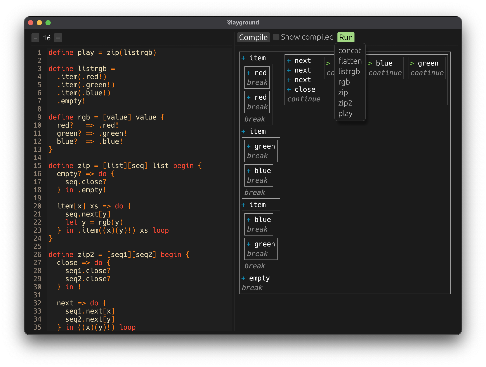

# An experimental concurrent language with an interactive playground



## Setting up

If you don't have Rust and Cargo installed, [do that first](https://doc.rust-lang.org/cargo/getting-started/installation.html). Then clone this repository and execute

```
$ cargo run
```

to open the interactive playground.

# The Par language guide

Par (⅋) is an experimental concurrent programming language. It's an attempt to bring the expressive power
of linear logic into practice.

> 📚 **Don't worry if you don't know anything about logic**, you might have interacted
> with it without knowing anyway. Functional programming is based on intuitionistic logic. Rust's ownership system
> is based on affine logic, which is very similar to linear logic. The only difference between the two is that
> affine logic lets you not use a value, drop it. Turns out this is a crucial difference. As we'll see, disallowing
> this ability lets us build a whole new way of doing concurrency.

Since this is a programming language guide and not a math textbook, we won't be mentioning logic from now on,
until the very last section. **It's not important to know anything about logic to understand the language.**
The value of basing the language on linear logic is that it provides a powerful design guidance.

First off, let's list some **general properties of Par:**

- Code executes in **isolated processes.**
- Processes **communicate** with each other **via channels.**
- Every channel has **two end-points, in two different processes.**
- **Two processes share at most one channel.**
- The previous two properties guarantee, that **deadlocks are not possible.**
- **No disconnected, unreachable processes.** If we imagine a graph with processes as nodes, and channels
  as edges, it will always be a single connected tree.

Despite the language being dynamically typed at the moment, the above properties hold. With the exception of
_no unreachable processes_, they also hold statically. **A type system with linear types is on the horizon,**
but I want to fully figure out the semantics first.

The main idea of Par is that **all values are channels.** Processes are intangible, they only exist by
executing, and operating on tangible objects: channels. How can it possibly all be channels?

- **A list?** That's a channel sending all its items in order, then signaling the end.
- **A function?** A channel that receives the function argument, then becomes the result.
- **An infinite stream?** Also a channel! This one will be waiting to receive a signal to either
  produce the next item, or to close.

Some features important for a real-world language are still **missing:**

- Primitive types, like **strings and numbers.** However, Par is expressive enough to enable custom
  representations of numbers, booleans, lists, streams, and so on. Just like λ-calculus, but with channels
  and expressive concurrency.
- **Replicable values.** But, once again, replication can be implemented manually, for now.
- **Non-determinism.** This can't be implemented manually, but I alredy have a mechanism thought out.

One non-essential feature that I really hope will make it into the language later is **reactive values.**
It's those that update automatically based on their dependencies changing.

TODO
